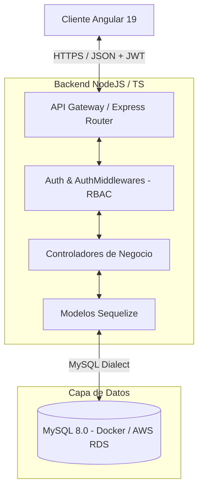

# 🏫 Sistema de Gestión de Préstamos de Equipos (UTP)
¡Bienvenido al sistema **Fullstack de Préstamos de Equipos de la Universidad Tecnológica de Pereira (UTP)**! Este ecosistema está diseñado bajo un modelo de arquitectura de tres capas robusta, segura y reactiva, desarrollado con tecnologías modernas que garantizan un rendimiento óptimo y un cumplimiento estricto de las mejores prácticas de ingeniería de software.

---

## 🏛️ Arquitectura General del Ecosistema

El sistema se compone de tres piezas de software perfectamente integradas:
1. **Frontend (Angular 19)**: Una SPA reactiva, modular, basada en componentes **Standalone** y APIs modernas como **Signals** y **Computed** que optimizan la renderización del DOM y eliminan sobrecargas.
2. **Backend (Node.js + Express + TypeScript)**: Un servidor API REST modular bajo el estándar estricto de compilación de TypeScript, acoplado al ORM **Sequelize** y protegido por autenticación basada en roles (RBAC) y tokens **JWT**.
3. **Database (MySQL 8.0)**: Un motor relacional estructurado, dockerizado localmente para el desarrollo y preparado para escalar a la nube a través de **AWS RDS**.

### Diagrama de Flujo y Capas (Mermaid)



---

## 🛠️ Stack Tecnológico

*   **Frontend**: Angular 19.2+, Angular Material, TypeScript, RxJS, Sass (SCSS).
*   **Backend**: Node.js, Express, TypeScript (Strict Mode), Sequelize v6, JSON Web Tokens (JWT), BcryptJS.
*   **Base de Datos**: MySQL 8.0 (Dockerizado para desarrollo), AWS RDS (Preparado para producción).
*   **Orquestación**: Docker, Docker Compose, Git.

---

## 📋 Prerrequisitos de Ejecución

Antes de iniciar la instalación, asegúrate de contar con las siguientes herramientas en tu sistema local:
1. **Node.js**: Versión 18.x o superior (Recomendado LTS v20+).
2. **npm**: Versión 9.x o superior (incluido con Node.js).
3. **Docker Desktop**: Necesario para levantar el contenedor de la base de datos localmente.
4. **Git**: Para control de versiones y clonación del repositorio.

---

## 🚀 Guía Rápida de Orquestación e Instalación

Sigue detalladamente estos **4 pasos** para tener todo el ecosistema funcionando en tu máquina en menos de 5 minutos:

### Paso 1: Clonar el Repositorio
Abre tu terminal favorita y clona el proyecto:
```bash
git clone https://github.com/juanbedoya1603/proyecto-prestamos-utp.git
cd proyecto-prestamos-utp
```

### Paso 2: Levantar la Base de Datos Local
Asegúrate de que Docker Desktop está corriendo. Ejecuta el comando de orquestación en la raíz del proyecto para iniciar la base de datos MySQL en segundo plano:
```bash
docker-compose up -d
```
> [!NOTE]
> Esto levantará un contenedor MySQL en el puerto `3306` con la base de datos `prestamos_utp_db` y el usuario `root` con contraseña `root1234`.

### Paso 3: Configurar e Instalar el Servidor (Backend)
1. Navega al directorio del backend:
   ```bash
   cd backend
   ```
2. Instala todas las dependencias requeridas (compilación e infraestructura):
   ```bash
   npm install
   ```
3. Configura el archivo de variables de entorno `.env`. Puedes duplicar la plantilla de ejemplo:
   ```bash
   cp .env.example .env
   ```
   *Verifica que las credenciales de base de datos coincidan con las de `docker-compose.yml` (para más detalles, lee el [README del Backend](file:///c:/Users/bedoy/OneDrive/Desktop/Programacion/Progra%20WEB/Proyecto%20Final%20Web/proyecto-prestamos-utp/backend/README.md)).*
4. Levanta el servidor en modo desarrollo:
   ```bash
   npm run dev
   ```
   > [!IMPORTANT]
   > Al iniciar por primera vez, el servidor sincronizará automáticamente las tablas en MySQL y **ejecutará el seeder de base de datos**, poblando el inventario, categorías, roles, permisos y credenciales de prueba de forma automática.

### Paso 4: Configurar e Instalar el Cliente (Frontend)
1. Abre una nueva pestaña en tu terminal y navega al directorio del frontend:
   ```bash
   cd ../front
   ```
2. Instala los paquetes y dependencias del cliente (Angular, Material y RxJS):
   ```bash
   npm install
   ```
3. Inicia el servidor de desarrollo local de Angular:
   ```bash
   npm start
   ```
4. Abre tu navegador e ingresa a: **`http://localhost:4200/`**

---

## 🔑 Credenciales de Prueba (Seeded Data)

Para facilitar la evaluación de la rúbrica académica, la base de datos se precarga de forma automática con dos roles de prueba con diferentes permisos (RBAC):

| Rol | Correo Electrónico | Contraseña | Capacidades en el Sistema |
| :--- | :--- | :--- | :--- |
| **Super Administrador** | `super@admin.com` | `Super@1234` | Gestión completa de usuarios, creación y edición de inventario, asignación de préstamos a terceros, devoluciones. |
| **Estudiante / Usuario** | `estudiante@utp.edu.co` | `Estudiante@1234` | Visualización del inventario de equipos (con acciones de administrador ocultas), solicitud de auto-préstamos privados, vista aislada de préstamos propios. |

---

## 📂 Enlaces a Documentación de Capa

Para una inmersión profunda en la arquitectura y endpoints de cada capa, consulta:
*   📖 **Documentación del Backend**: [backend/README.md](file:///c:/Users/bedoy/OneDrive/Desktop/Programacion/Progra%20WEB/Proyecto%20Final%20Web/proyecto-prestamos-utp/backend/README.md)
*   📖 **Documentación del Frontend**: [front/README.md](file:///c:/Users/bedoy/OneDrive/Desktop/Programacion/Progra%20WEB/Proyecto%20Final%20Web/proyecto-prestamos-utp/front/README.md)
*   📖 **Documentación del Backup de Datos**: [database/README.md](file:///c:/Users/bedoy/OneDrive/Desktop/Programacion/Progra%20WEB/Proyecto%20Final%20Web/proyecto-prestamos-utp/database/README.md)
