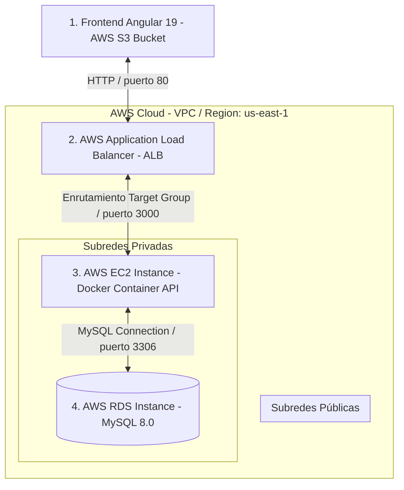

# 🏫 Sistema de Gestión de Préstamos de Equipos (UTP)
¡Bienvenido al sistema **Fullstack de Préstamos de Equipos de la Universidad Tecnológica de Pereira (UTP)**! El proyecto ha migrado exitosamente desde un entorno de simulación local a una **infraestructura en la nube de alta disponibilidad y tolerancia a fallos sobre Amazon Web Services (AWS)**, diseñada bajo un modelo de arquitectura de tres capas robusta, fuertemente tipada y escalable.

---

## 🏛️ Arquitectura de Producción en AWS

El sistema se compone de cuatro capas fundamentales desplegadas en la región `us-east-1` de AWS:
1.  **Capa de Frontend (AWS S3 Static Website Hosting)**: La SPA de Angular 19 se compila de forma estática y se despliega en un bucket de **Amazon S3** optimizado para alojamiento web estático (con políticas de lectura GetObject y redirección interna a `index.html`).
2.  **Capa de Red (AWS ALB)**: Un **Application Load Balancer (ALB)** "Internet-facing" que escucha por el puerto 80 (HTTP) y enruta de forma segura el tráfico hacia las instancias de cómputo del backend mediante Target Groups con chequeos de salud automatizados en `/health`.
3.  **Capa de Backend (AWS EC2 + Docker)**: El servidor Node.js/TypeScript corre dentro de contenedores **Docker (Node 18 Alpine)** en una máquina virtual **AWS EC2 (Ubuntu 24.04)**. El puerto `3000` de la EC2 está completamente cerrado al público y solo acepta tráfico de entrada proveniente del grupo de seguridad del ALB.
4.  **Capa de Datos (AWS RDS)**: Persistencia relacional confiable en **AWS RDS (MySQL 8.0)** desplegada en subredes privadas. Cuenta con un Security Group restrictivo que solo permite tráfico entrante por el puerto `3306` desde la instancia EC2.

### Diagrama de Flujo y Red en AWS (Mermaid)



---

## 🛠️ Stack Tecnológico

*   **Frontend**: Angular 19.2+, Angular Material, TypeScript, Signals & Computed reactivo, Sass (SCSS).
*   **Backend**: Node.js, Express, TypeScript (Strict Mode), Sequelize v6, JSON Web Tokens (JWT), BcryptJS.
*   **Base de Datos**: AWS RDS (MySQL 8.0 - Producción), MySQL 8.0 (Dockerizado - Desarrollo).
*   **Infraestructura de Nube & DevOps**:
    *   **AWS EC2 (Elastic Compute Cloud)**: Cómputo flexible en nube (Ubuntu 24.04).
    *   **AWS RDS (Relational Database Service)**: Alta disponibilidad y respaldos de base de datos relacional.
    *   **AWS ALB (Application Load Balancer)**: Balanceo inteligente de peticiones HTTPS.
    *   **Amazon S3 (Simple Storage Service)**: Alojamiento estático del frontend y almacenamiento manual de backups/assets.
    *   **AMIs (Amazon Machine Images)**: Plantillas preconfiguradas del servidor para aprovisionamiento rápido y Auto Scaling.
    *   **Docker & Docker Compose**: Empaquetado, portabilidad y orquestación de contenedores.

---

## 📋 Prerrequisitos de Ejecución Local

Antes de iniciar de manera local, asegúrate de contar con:
1. **Node.js** v18+ o superior.
2. **Docker Desktop** (para levantar MySQL de forma local si no deseas usar RDS en desarrollo).

---

## 🚀 Guías de Ejecución por Entornos

---

### Opción A: Entorno de Desarrollo (Local) 💻

Sigue detalladamente estos pasos si deseas realizar modificaciones de código de forma local con base de datos en Docker:

#### Paso 1: Clonar el Repositorio
```bash
git clone https://github.com/juanbedoya1603/proyecto-prestamos-utp.git
cd proyecto-prestamos-utp
```

#### Paso 2: Levantar la Base de Datos Local
Asegúrate de restaurar el bloque original de base de datos en tu `docker-compose.yml` local o ejecuta MySQL en tu puerto `3306`:
```bash
docker-compose up -d
```

#### Paso 3: Configurar e Instalar el Servidor (Backend)
1. Entra a backend e instala dependencias:
   ```bash
   cd backend
   npm install
   ```
2. Configura tu `.env` local (`DB_HOST=127.0.0.1` o `localhost`).
3. Corre el servidor en desarrollo local (esto creará las tablas y ejecutará el seed automáticamente):
   ```bash
   npm run dev
   ```

#### Paso 4: Configurar e Instalar el Cliente (Frontend)
1. En otra terminal entra a front e instala dependencias:
   ```bash
   cd ../front
   npm install
   ```
2. Inicia el servidor de desarrollo local de Angular:
   ```bash
   npm start
   ```
3. Navega en tu navegador a: **`http://localhost:4200/`**

---

### Opción B: Entorno de Producción (AWS Cloud) ☁️

Este es el flujo para compilar, dockerizar y desplegar actualizaciones directamente sobre la infraestructura real de producción en AWS:

#### Paso 1: Empaquetar y Desplegar el Backend en AWS EC2
1.  **Construir Imagen**: En la instancia EC2 o en el pipeline de CI/CD, construye la imagen a partir del `Dockerfile` (Node 18 Alpine):
    ```bash
    docker-compose build
    ```
2.  **Iniciar API**: Levanta el contenedor orquestado del backend en la instancia EC2. Este correrá en el puerto `3000` internamente:
    ```bash
    docker-compose up -d
    ```
3.  **Chequeo de Salud**: El balanceador ALB monitorea la salud del contenedor consumiendo automáticamente el endpoint `/health` expuesto en el puerto `3000`.

#### Paso 2: Compilar y Desplegar el Frontend en AWS S3
1.  **Endpoint del ALB**: Verifica que las URLs de conexión en los servicios de Angular (`auth.service.ts`, `equipment.service.ts`, `loan.service.ts`, `user.service.ts`) apunten al balanceador público de carga de AWS:
    `http://alb-prestamos-utp-56970636.us-east-1.elb.amazonaws.com`
2.  **Compilar Angular**: Genera el bundle optimizado para producción en tu máquina local o servidor de compilación:
    ```bash
    npm run build
    ```
3.  **Subir a S3**: Sube el contenido de la carpeta `/dist/front` al bucket de S3 utilizando la CLI de AWS:
    ```bash
    aws s3 sync dist/front s3://s3-prestamos-utp-front-prod --delete
    ```
4.  **Acceso Web**: El frontend estará disponible a nivel mundial a través del endpoint HTTP provisto por el Static Website Hosting del bucket de S3.

---

## 🔑 Credenciales de Prueba (Seeded Data)

El sistema de base de datos AWS RDS se encuentra precargado con los siguientes roles y usuarios para la evaluación:

| Rol | Correo Electrónico | Contraseña | Capacidades en el Sistema |
| :--- | :--- | :--- | :--- |
| **Super Administrador** | `super@admin.com` | `Super@1234` | Gestión completa de usuarios, creación y edición de inventario, asignación de préstamos a terceros, devoluciones. |
| **Estudiante / Usuario** | `estudiante@utp.edu.co` | `Estudiante@1234` | Visualización del inventario de equipos (con acciones de administrador ocultas), solicitud de auto-préstamos privados, vista aislada de préstamos propios. |

---

## 📂 Enlaces a Documentación de Capa

Para una inmersión profunda en la arquitectura y endpoints de cada capa, consulta:
*   📖 **Documentación del Backend**: [backend/README.md](file:///c:/Users/bedoy/OneDrive/Desktop/Programacion/Progra%20WEB/Proyecto%20Final%20Web/proyecto-prestamos-utp/backend/README.md)
*   📖 **Documentación del Frontend**: [front/README.md](file:///c:/Users/bedoy/OneDrive/Desktop/Programacion/Progra%20WEB/Proyecto%20Final%20Web/proyecto-prestamos-utp/front/README.md)
*   📖 **Documentación del Backup de Datos**: [database/README.md](file:///c:/Users/bedoy/OneDrive/Desktop/Programacion/Progra%20WEB/Proyecto%20Final%20Web/proyecto-prestamos-utp/database/README.md)
